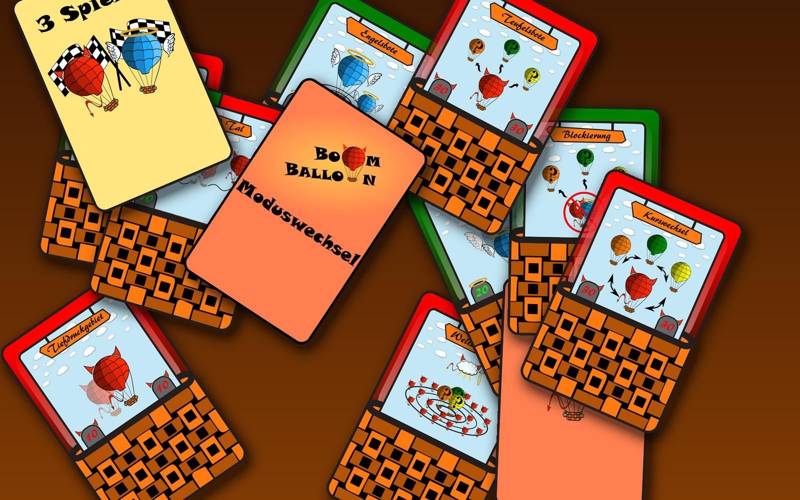

# Boom Balloon

**An electronic party game where players use playing cards to inflate a balloon until it bursts.**

Boom Balloon is a card game together with a machine you can insert the cards into. Every card you play either inflates or deflates the balloon attached to the machine. It swells, the tension rises, and nobody knows which card will be the one too many.

[How It Works](how-it-works.md){ .md-button .md-button--primary }
[The Card Deck](gameplay/card-deck.md){ .md-button }
[Build Guide](build-guide/overview-bom.md){ .md-button }

## See it in action

<button class="video-embed" type="button" data-video-id="Xgrgn9xl6cM" aria-label="Play video: Boom Balloon in action">

Prototype 1
</button>
<button class="video-embed" type="button" data-video-id="8Uy-vG2rXMY" aria-label="Play video: Boom Balloon in action">

Prototype 2
</button>
<button class="video-embed" type="button" data-video-id="tC41wgui3Lg" aria-label="Play video: Boom Balloon in action">

Prototype 3
</button>

## Explore the build

<a class="jump-card" href="build-guide/enclosure/">

<strong>Enclosure</strong>The printed housing — parts, dimensions, and CAD downloads
</a>
<a class="jump-card" href="build-guide/modules/">

<strong>Modules</strong>Three custom PCBs: card reader, control board, display
</a>
<a class="jump-card" href="build-guide/wiring/">

<strong>Wiring</strong>How every module connects back to the Arduino Nano
</a>
<a class="jump-card" href="gameplay/card-deck/">

<strong>Card Deck</strong>The optical code behind every card, and the full deck
</a>

---

Boom Balloon was a hobby project built between roughly 2016 and 2018, reaching a working, multi-unit prototype with complete firmware. Dig into the [build guide](build-guide/overview-bom.md) or the [reference](reference/bill-of-materials.md) section for the full technical detail.
